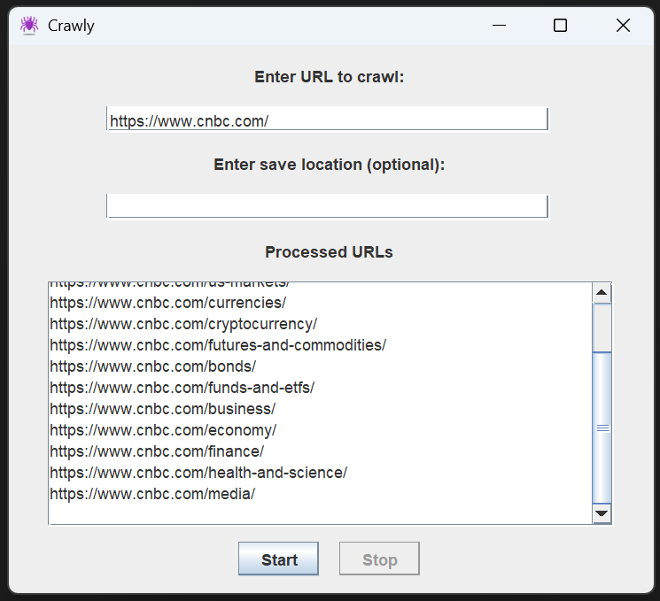
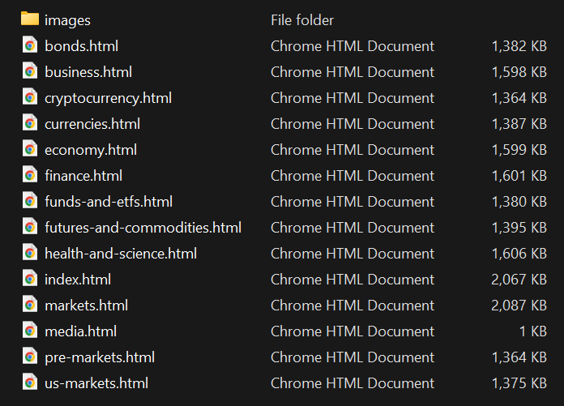
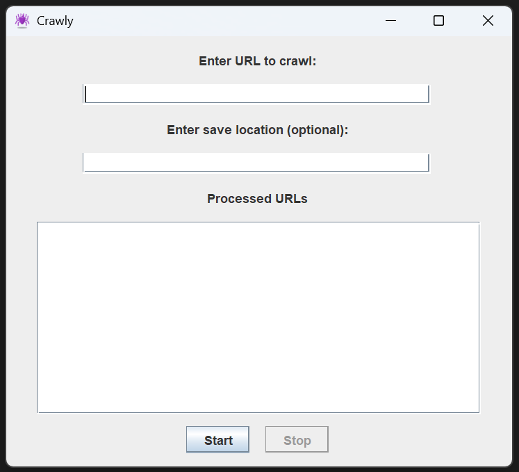

# Crawly

A Java web crawler and scraper for creating offline website archives. Recursively downloads pages and images within a domain, rewrites links for local browsing, and runs with either command-line arguments or a GUI interface.

**Requirements**: Java 11 or higher

## Example usage

#### GUI after crawling a website:



#### Downloaded files after crawling:



## How to Download Crawly

You can download Crawly from the [Releases](../../releases) page in three formats:

1. **Crawly.exe** - Windows executable (Windows x86 users only)
2. **crawly-jar-with-dependencies.jar** - Fat JAR file (cross-platform and includes all dependencies, recommended for general use)
3. **crawly-2.1.0.jar** - Thin JAR file (requires manual dependency management, <u>not</u> recommended for general use)

### About the Windows Executable

The `Crawly.exe` file was created using [Launch4j](https://launch4j.sourceforge.net/), a Java executable wrapper. Launch4j allows Java applications to be packaged as native Windows executables, providing a more user-friendly experience by eliminating the need to manually invoke Java from the command line. The executable automatically detects your Java installation and launches the application with the appropriate Java runtime.

## How to Run Crawly

### Option 1: Run the Windows Executable (for Windows x86 users)

Download `Crawly.exe` from Releases and double-click to launch the GUI application.

### Option 2: Run the JAR File

Download `crawly-jar-with-dependencies.jar` from Releases and run it using Java. Entering command line arguments will start the application in command line mode; omitting arguments will launch the GUI. Entering a URL is required, but specifying a save location is optional. You can provide either a relative or an absolute path. If you don't specify a save location, the application will create a directory called `output` in the same directory where Crawly is running. 

#### <u>Command Line Mode (with arguments)</u>

```bash
java -jar crawly-jar-with-dependencies.jar <url> [save-location]
```

Examples:

```bash
java -jar crawly-jar-with-dependencies.jar http://example.com
java -jar crawly-jar-with-dependencies.jar http://example.com ./downloads
```

#### <u>GUI Mode (without arguments)</u>

```bash
java -jar crawly-jar-with-dependencies.jar
```

This will open the graphical user interface where you can enter the URL and save location.

## How to Use Crawly GUI

When you run the application in GUI mode, you'll see this window with the following elements:



#### Input Fields

- **URL Field**: Enter the website URL you want to crawl (<b>required</b>). The URL must include the protocol (e.g., `http://` or `https://`).
- **Save Location Field**: Specify where you want to save the downloaded files (<b>optional</b>). If left empty, files will be saved to an `output` folder in the current directory.

#### Controls

- **Start Button**: Begins the web crawling process. You should shortly see a list of crawled URLs in the GUI.

- **Stop Button**: Immediately stops the crawling process. You can view the list of crawled URLs until you begin a new crawl.


#### Status Display

- **Processed URLs List**: A scrollable text area that shows all URLs being processed in real-time. Cleared when you start a new crawl.

## Current Features

- **Dual Interface**: Command-line and GUI modes
- **Domain Restriction**: Only follows links within the original domain to prevent external crawling
- **Offline Browsing**: Downloads HTML content and rewrites URLs to point to local files
- **Image Handling**: Downloads and saves images locally with centralized organization
- **Path Preservation**: Maintains website directory structure in local filesystem
- **Interruption Support**: GUI allows graceful start/stop of crawling operations
- **Real-time Status Updates**: Displays processed URLs in the GUI during crawling

## Planned Features

- Configurable crawl depth limits
- Enhanced file type support

## Technologies Used

- **Java 11+** - Core programming language (compiled for Java 11, tested with newer versions)
- **JSoup 1.17.2** - HTML parsing and web scraping
- **Maven** - Dependency management and build tool
- **Swing** - GUI framework for desktop interface
- **JUnit 5** - Testing framework with embedded HTTP server
- **Launch4j** - Java executable wrapper for Windows
